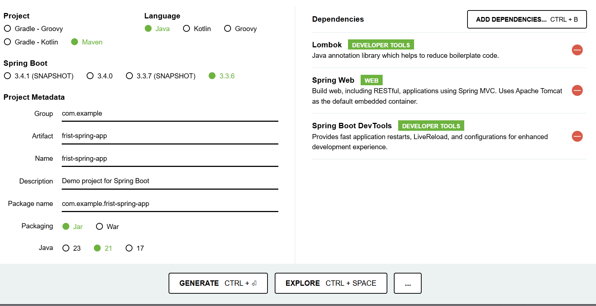

## Criação do Projeto

- Fui no site https://start.spring.io/ e gerei o projeto base com as dependências.

- O que é o Maven ? 

    O Maven é uma ferramenta que auxilia o desenvolvedor no gerenciamento das dependências do projeto, disponibilização de plugins para criação de executáveis (JAR, WAR, EAR/ se tratando do Java), geração de documentação, execução de testes automatizados.
    
    O Maven também ajuda a padronizar a estrutura do projeto, o que facilita a colaboração entre os membros da equipe e o desenvolvimento de projetos maiores. Ele utiliza um arquivo de configuração chamado pom.xml (Project Object Model) para definir as dependências do projeto, as configurações de compilação, os plugins necessários e outras informações relevantes.
